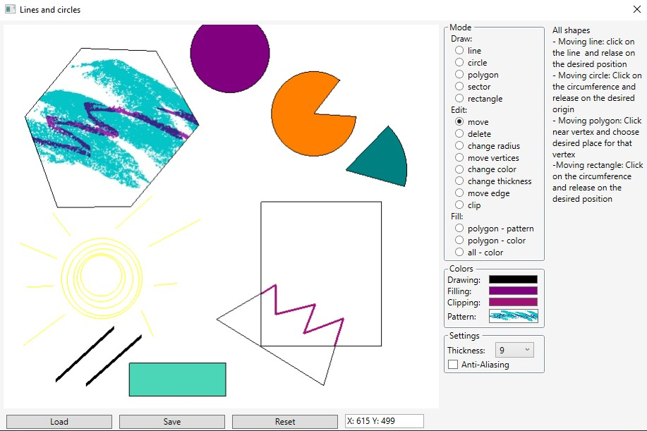

# AlmostPaint
WPF Paint Application project with selected Computer Grphics algorithms.

## Features and algorithms used
- Draw and edit:
  - line *(Midpoint line)* with different thicknesses *(Copying pixels)*
  - circle *(Midpoint circle with addition)* 
  - polygon
  - sector
  - rectangle
- Add Anti-aliasing for lines and circles *(Xiaolin Wu)*
- Clip polygons and lines to rectangle *(Liang-Barsky)*
- Fill polygons with images and colors *(Scan-Line algorithm with Vertex Sorting)*
- Fill shapes with colors *(4-connected BoundaryFill without recursion)*
- Save your drawings to JSON and load them back to continue your work

